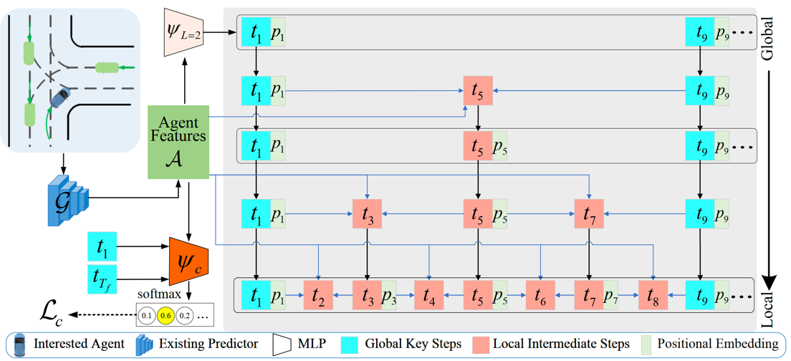

## G2LTraj: A Global-to-Local Generation Approach for Trajectory Prediction
<div align='center'>
  
  <br>A common pipeline of trajectory prediction models and the proposed G2LTraj.
</div>


## Model Training 
### Setup
**Environment**
<br>All models were trained and tested on Ubuntu 18.04 with Python 3.7 and PyTorch 1.12.1 with CUDA 11.1.

**Dataset**
<br>Preprocessed [ETH](https://data.vision.ee.ethz.ch/cvl/aem/ewap_dataset_full.tgz) and [UCY](https://graphics.cs.ucy.ac.cy/research/downloads/crowd-data) datasets are included in this repository, under `./datasets/`. 
The train/validation/test splits are the same as those fond in [Social-GAN](https://github.com/agrimgupta92/sgan).

You can also download the dataset by running the following script.
```bash
./scripts/download_datasets.sh
```

**Baseline models**
<br>This repository supports six baseline models: 
[**AgentFormer**](https://arxiv.org/abs/2103.14023), 
[**DMRGCN**](https://ojs.aaai.org/index.php/AAAI/article/view/16174),
[**Graph-TERN**](https://ojs.aaai.org/index.php/AAAI/article/view/25759),
[**PECNet**](https://arxiv.org/abs/2004.02025), 
[**SGCN**](https://arxiv.org/abs/2104.01528) and 
[**Social-STGCNN**](https://arxiv.org/abs/2002.11927). 
We have included model source codes from their official GitHub in the `./baselines/` folder. 


### Train G2LTraj
To train our G2LTraj on the ETH and UCY datasets at once, we provide a bash script `train.sh` for a simplified execution.
```bash
./scripts/train.sh
```
We provide additional arguments for experiments: 
```bash
./scripts/train.sh -t <experiment_tag> -b <baseline_model> -c <config_file_path> -p <config_file_prefix> -d <space_seperated_dataset_string> -i <space_seperated_gpu_id_string>

# Supported baselines: agentformer, dmrgcn, graphtern, pecnet, sgcn, stgcnn
# Supported datasets: eth, hotel, univ, zara1, zara2

# Examples
./scripts/train.sh -b sgcn -d "hotel" -i "1"
./scripts/train.sh -b agentformer -t agentformer -d "zara2" -i "2"
./scripts/train.sh -b pecnet -c ./config/  -d "eth hotel univ zara1 zara2" -i "0 0 0 0 0"
```
If you want to train the model with custom hyper-parameters, use `trainval.py` instead of the script file.
```bash
python trainval.py --cfg <config_file_path> --tag <experiment_tag> --gpu_id <gpu_id> 
```


## Model Evaluation
### Pretrained Models
We will provide all pretrained models in the checkpoints folder. 


### Evaluate G2LTraj
To evaluate our G2LTraj at once, we provide a bash script `test.sh` for a simplified execution.
```bash
./scripts/test.sh -t <experiment_tag> -b <baseline_model> -c <config_file_path> -p <config_file_prefix> -d <space_seperated_dataset_string> -i <space_seperated_gpu_id_string>

# Examples
./scripts/test.sh -b sgcn -d "hotel" -i "1"
./scripts/test.sh -b agentformer -t agentformer -d "zara2" -i "2"
./scripts/test.sh -b pecnet -c ./config/ -d "eth hotel univ zara1 zara2" -i "0 0 0 0 0"
```

If you want to evaluate the model individually, you can use `trainval.py` with custom hyper-parameters. 
```bash
python trainval.py --test --cfg <config_file_path> --tag <experiment_tag> --gpu_id <gpu_id> 
```

## Acknowledgement

Our code builds upon [EigenTrajectory](https://github.com/InhwanBae/EigenTrajectory). 
We appreciate all the contributors for their awesome work.


